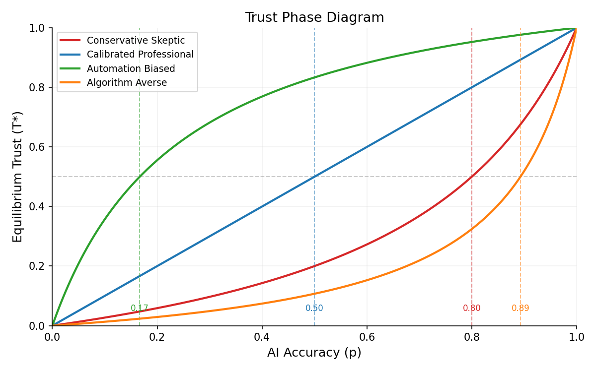
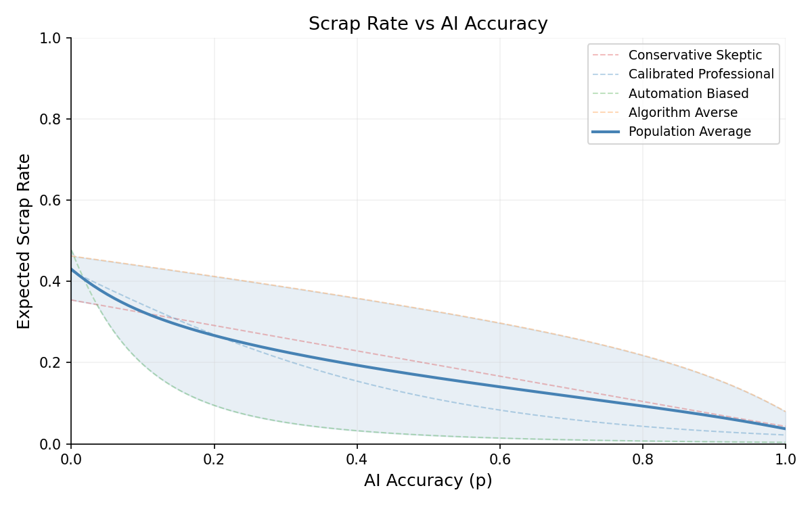
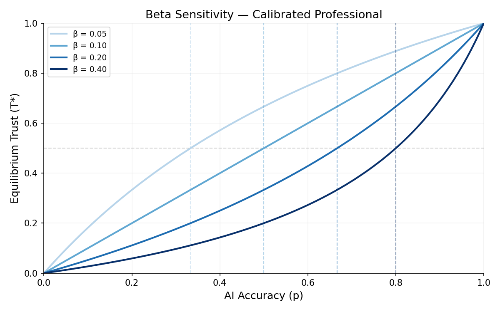
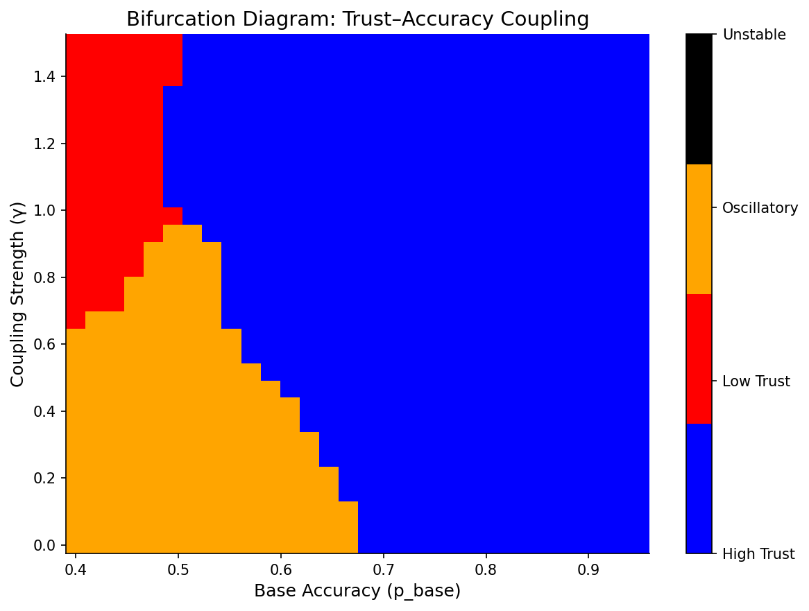
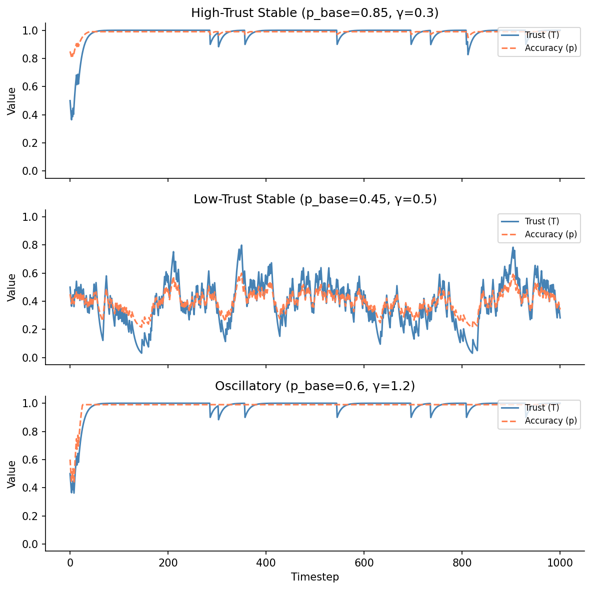

# HAWKS

**Human–AI Workforce Dynamics in Safety-Critical Manufacturing**


## Overview

HAWKS is a research framework for modeling how human trust in AI evolves
over time in safety-critical environments.

We formalize operator belief dynamics as a structured dynamical system and study:

- Closed-form trust equilibria
- Critical AI accuracy thresholds
- Stability regimes under coupled human–AI feedback
- Learnability of belief dynamics via neural surrogates

The project establishes:

- A mechanistic baseline (analytically tractable trust dynamics)
- A heterogeneous population model (behavioral archetypes)
- A neural surrogate that approximates belief evolution from low-dimensional state inputs

This repo demonstrates that structured human belief updates are both
analytically solvable and empirically learnable.

## Research Questions

- Under what conditions does AI accuracy induce high-trust equilibrium?
- When does heterogeneous trust create population-level instability?
- Can belief dynamics be approximated by neural surrogates?
- What stability regimes emerge under adaptive AI feedback?

## Project Goals

- Model physics-based defect generation in FDM 3D printing (NylonX carbon fiber) with 9 coupled state variables per layer
- Simulate probabilistic AI defect detection with configurable accuracy and calibration presets
- Model human operator trust dynamics with asymmetric learning rates (alpha/beta)
- Study 4 behavioral archetypes and their population-level effects on manufacturing outcomes
- Derive closed-form trust equilibria and critical accuracy thresholds
- Analyze coupled trust-accuracy feedback loops and bifurcation regimes
- Generate ML-ready synthetic datasets for downstream research

## System Architecture

### Per-Step Simulation Pipeline

```
┌──────────────┐    ┌──────────────┐    ┌──────────────────┐    ┌────────────────┐    ┌─────────┐
│Manufacturing │───▸│ AI Detection │───▸│ Operator Decision│───▸│ Trust Feedback  │───▸│ Metrics │
│  (Physics)   │    │  (Classify)  │    │   (Accept/Rej)   │    │  (Update T)    │    │(Record) │
└──────────────┘    └──────────────┘    └──────────────────┘    └────────────────┘    └─────────┘
  PhysicsEngine      AIModelSimulator     HumanOperator           TrustModel          MetricsCollector
  ManufacturingTwin                        DecisionModel
```

### Module Map

```
hawks/
├── config.py              # HAWKSConfig and sub-configs (dataclasses + YAML loading)
├── seed.py                # SeedManager — deterministic RNG branching
├── types.py               # Frozen domain types (DefectInstance, PartResult, Detection, …)
├── manufacturing/
│   ├── physics_engine.py  # Layer-by-layer physics simulation (9 state variables)
│   ├── physics_state.py   # LayerState, LayerRisk, PrintTrace data structures
│   ├── digital_twin.py    # ManufacturingTwin — part production orchestrator
│   ├── part.py            # Part construction helpers
│   └── defect_gen.py      # DefectGenerator (legacy, unused)
├── detection/
│   ├── ai_model.py        # AIModelSimulator — TPR/FPR classification + calibrated confidence
│   ├── adaptive.py        # AdaptiveAIDetector — trust-dependent accuracy coupling
│   └── detector.py        # AIDefectDetector (legacy, unused)
├── operators/
│   ├── operator.py        # HumanOperator — individual agent with trust + decision models
│   ├── trust.py           # TrustModel — asymmetric Bayesian-inspired trust updates
│   ├── decision.py        # DecisionModel — sigmoid-based accept/reject
│   └── population.py      # OperatorPopulation + ARCHETYPES dictionary
├── engine/
│   ├── simulation.py      # SimulationEngine — main per-step orchestrator
│   ├── clock.py           # SimulationClock — discrete time + shift tracking
│   └── metrics.py         # MetricsCollector — append-only data recording
├── models/
│   └── surrogate.py       # TrustSurrogate — minimal MLP for trust prediction
├── data/
│   └── synthetic.py       # SyntheticDataGenerator — ML-ready dataset pipeline
└── experiment/
    ├── runner.py           # ExperimentRunner — sweeps and replications
    ├── analysis.py         # ResultsAnalyzer — trust evolution and detection plots
    ├── trust_analysis.py   # TrustAnalyzer — closed-form equilibrium and phase diagrams
    └── adaptive_analysis.py# StabilityAnalyzer — bifurcation heatmaps and regime classification
```

### Data Flow & Reproducibility

`SeedManager` takes a single `master_seed` and deterministically spawns independent `numpy.random.Generator` instances for each component (manufacturing, detection, operators). This guarantees full reproducibility from one integer and component-level statistical independence.

## Core Mathematical Models

### Trust Model

**Asymmetric update** — trust increases on correct AI predictions, decreases on incorrect:

```
T_{t+1} = T_t + α(1 − T_t)     on correct prediction
T_{t+1} = T_t − β·T_t          on incorrect prediction
```

**Equilibrium trust** (closed-form) at AI accuracy p:

```
T*(p) = p·α / (p·α + (1−p)·β)
```

**Critical accuracy** — the AI accuracy where equilibrium trust equals 0.5:

```
p_crit = β / (α + β)
```

### Operator Archetypes

| Parameter | Conservative Skeptic | Calibrated Professional | Automation Biased | Algorithm Averse |
|---|---|---|---|---|
| `initial_trust` | 0.30 | 0.50 | 0.80 | 0.45 |
| `alpha` (trust gain) | 0.05 | 0.10 | 0.15 | 0.03 |
| `beta` (trust loss) | 0.20 | 0.10 | 0.03 | 0.25 |
| `risk_tolerance` | 2.0 | 1.0 | 0.3 | 0.5 |
| `trust_weight` | 1.5 | 2.0 | 3.0 | 1.5 |
| `confidence_weight` | 1.0 | 1.5 | 2.5 | 0.8 |
| `decision_noise` | 0.3 | 0.2 | 0.15 | 0.35 |
| **p_crit** | **0.80** | **0.50** | **0.17** | **0.89** |

- **Conservative Skeptic** — Low initial trust, slow to gain trust, quick to lose it. Requires high AI accuracy (p > 0.80) to reach positive trust equilibrium.
- **Calibrated Professional** — Balanced trust dynamics. Symmetric learning. Reaches T* = 0.5 at p = 0.50.
- **Automation Biased** — High initial trust, fast to trust more, very slow to distrust. Maintains high trust even at low AI accuracy.
- **Algorithm Averse** — Moderate initial trust but very resistant to building more. Quick to distrust. Requires near-perfect AI (p > 0.89) for positive equilibrium.

### Decision Model

Operators make accept/reject decisions via a sigmoid function:

```
logit   = w_trust·T + w_conf·C + w_risk·R + N(0, σ²)
p_accept = σ(logit)
action  ~ Bernoulli(p_accept)     →  "accept" or "reject"
```

### Coupled Dynamics (Adaptive AI)

When AI accuracy depends on operator trust (feedback loop):

```
p_t = clamp(p_base + γ·(T_t − 0.5), 0.01, 0.99)
```

This creates four stability regimes:

| Regime | Condition | Description |
|---|---|---|
| `HIGH_TRUST` | mean(tail) > 0.7, low variance | Stable high-trust equilibrium |
| `LOW_TRUST` | mean(tail) < 0.3, low variance | Stable low-trust equilibrium |
| `OSCILLATORY` | moderate variance | Trust oscillates without converging |
| `UNSTABLE` | high variance (> 0.15) | Chaotic trust dynamics |

### Neural Surrogate Model

To test whether structured belief dynamics are learnable, we trained a small neural network to approximate the trust update rule:

```
T_{t+1} = f(T_t, p, α, β)
```

**Architecture:**

- 4 → 32 → 16 → 1 (Sigmoid)
- ReLU activations
- MSE loss

**Results:**

- Synthetic dataset: 3,980 samples
- Final validation MSE: 0.000205

The surrogate closely matches the mechanistic belief dynamics, demonstrating that heterogeneous human trust trajectories are learnable from low-dimensional state inputs.

The low validation error demonstrates that asymmetric belief updates form a smooth, learnable manifold in low-dimensional space. This suggests operator trust dynamics can be approximated by compact neural models without explicit mechanistic knowledge.

### AI Detection Model

**Classification** — Bernoulli draw based on confusion matrix rates:

```
predicted_positive ~ Bernoulli(TPR)   if part has defects
predicted_positive ~ Bernoulli(FPR)   if part is clean
```

**Calibrated probability** — sigmoid of logit-transformed physics risk:

```
predicted_prob = σ(logit(risk) + calibration_bias)
```

**Confidence score:**

```
confidence = clip(|predicted_prob − 0.5| × 2 + N(0, σ²), 0, 1)
```

**Presets:**

| Preset | TPR | FPR | Calibration Bias | Confidence Noise |
|---|---|---|---|---|
| `well_calibrated` | 0.90 | 0.05 | 0.0 | 0.05 |
| `overconfident` | 0.85 | 0.10 | +1.5 | 0.02 |
| `underconfident` | 0.90 | 0.05 | −0.5 | 0.15 |

### Manufacturing Physics

Each part is simulated layer-by-layer with **9 state variables** per layer:

| Variable | Description |
|---|---|
| `nozzle_temp` | Nozzle temperature with linear drift + noise |
| `bed_temp` | Bed temperature with exponential decay |
| `ambient_temp` | Ambient temperature with noise |
| `vibration` | Vibration amplitude, increases with height |
| `extrusion_error` | Extrusion deviation from nominal |
| `cooling_rate` | Thermal gradient (nozzle − ambient), damped by height |
| `adhesion` | Inter-layer adhesion strength (sigmoid) |
| `cumulative_stress` | Accumulated mechanical stress |
| `z_height` | Current build height |

**Temperature dynamics:**

```
T_nozzle = T_setpoint + drift_rate · i + N(0, σ_nozzle²)
T_bed    = T_setpoint · exp(−decay_rate · z) + N(0, σ_bed²)
```

**Adhesion (sigmoid combining thermal and mechanical factors):**

```
adhesion = σ(w_nozzle·T_n + w_bed·T_b − w_cool·C − w_ext·|E| − w_vib·V + bias)
```

where σ(x) = 1/(1 + exp(−x)).

**Stress accumulation:**

```
stress_{i+1} = stress_i + (w_thermal·ΔT + w_adhesion·(1−adh) + w_vibration·V + w_height·z/z_max) / n_layers
```

**Structural risk (sigmoid mapping all risk factors to [0, 1]):**

```
risk = σ(w_thermal·thermal_inst + w_adhesion·adh_deficit + w_vibration·vib_norm
         + w_height·height_frac + w_stress·cumulative_stress + bias)
```

**Defect type** is determined by the dominant risk factor:

| Dominant Factor | Defect Type |
|---|---|
| Thermal instability | Porosity |
| Adhesion deficit | Delamination |
| Vibration | Geometric distortion |
| Height fraction | Cracking |

Defects are generated only when `structural_risk > risk_threshold`, with severity scaled as:

```
severity = clip((risk − threshold) / (1 − threshold), 0, 1)
```

## Installation

```bash
# Core installation
pip install -e .

# With development dependencies (pytest)
pip install -e ".[dev]"

# Optional: PyTorch for tensor export
pip install torch
```

**Requirements:** Python ≥ 3.11, numpy ≥ 1.24, pandas ≥ 2.0, matplotlib ≥ 3.7, pyyaml ≥ 6.0

## Quick Start

### CLI

```bash
# Run a single simulation with default config
hawks-run --config configs/default.yaml --output results.csv

# Run with replications (different seeds)
hawks-run --config configs/default.yaml --replications 5 --output sweep.csv
```

### Python API

**Single simulation:**

```python
from hawks.config import HAWKSConfig
from hawks.engine.simulation import SimulationEngine

config = HAWKSConfig.from_yaml("configs/default.yaml")
engine = SimulationEngine(config)
metrics = engine.run()

df = metrics.to_dataframe()
print(metrics.summary())
```

**Parameter sweep:**

```python
from hawks.experiment.runner import ExperimentRunner

runner = ExperimentRunner()
results = runner.run_sweep(
    base_config=config,
    param_grid={"detection.true_positive_rate": [0.7, 0.85, 0.95]},
)
```

**Synthetic dataset generation:**

```python
from hawks.data.synthetic import SyntheticDataGenerator

gen = SyntheticDataGenerator(n_operators=50, n_steps=1000, master_seed=42)
df = gen.generate()                        # 50,000 interaction rows
gen.save(df, "data/dataset.csv", fmt="csv") # CSV + .meta.json sidecar

# PyTorch tensors
tensors = SyntheticDataGenerator.to_tensors(df)
# tensors["features"]  — (N, 4) float tensor
# tensors["decisions"] — (N,) int tensor
```

**Trust analysis (closed-form):**

```python
from hawks.experiment.trust_analysis import TrustAnalyzer

analyzer = TrustAnalyzer()
t_eq = analyzer.equilibrium_trust(alpha=0.10, beta=0.10, p=0.85)
p_c  = analyzer.critical_accuracy(alpha=0.10, beta=0.10)

fig = analyzer.plot_phase_diagram()    # T*(p) curves per archetype
fig = analyzer.plot_scrap_rate()       # Population scrap rate vs accuracy
fig = analyzer.plot_beta_sensitivity("conservative_skeptic")
```

**Stability analysis (coupled dynamics):**

```python
from hawks.experiment.adaptive_analysis import StabilityAnalyzer

sa = StabilityAnalyzer(archetype_name="calibrated_professional", master_seed=42)
trust_hist, acc_hist = sa.simulate_trajectory(p_base=0.8, gamma=0.5)

fig = sa.plot_bifurcation_heatmap()    # Regime map over (p_base, gamma)
fig = sa.plot_trajectory_examples()    # Example trust trajectories
report = sa.report()                   # Analytical summary
```

**Reproduce surrogate training:**

```bash
python scripts/train_surrogate.py
```

Expected output:
```
Dataset: 3980 samples, 4 features
Final  train_mse≈0.0002  val_mse≈0.0002
Model saved to models/surrogate.pt
```

## Configuration

Simulations are configured via YAML files. See [`configs/default.yaml`](configs/default.yaml) for the full reference.

| Section | Key Parameters | Description |
|---|---|---|
| `manufacturing` | `num_layers_per_part`, `nozzle_temp_setpoint`, adhesion/stress/risk weights | Physics engine parameters for FDM simulation |
| `detection` | `true_positive_rate`, `false_positive_rate`, `calibration_bias` | AI model accuracy and calibration |
| `population` | `num_operators`, `archetype_mix`, `parameter_noise` | Workforce composition and heterogeneity |
| `clock` | `num_steps`, `parts_per_step` | Simulation duration and throughput |
| `master_seed` | integer | Single seed for full reproducibility |

## Synthetic Datasets

The `SyntheticDataGenerator` produces ML-ready datasets with full provenance tracking.

**DataFrame columns:**

| Column | Type | Description |
|---|---|---|
| `step` | int64 | Simulation step index |
| `operator_id` | str | Operator identifier (e.g., "OP-001") |
| `archetype` | str | Operator archetype name |
| `structural_risk` | float64 | Physics-based risk score [0, 1] |
| `ai_confidence` | float64 | AI model confidence [0, 1] |
| `ai_correctness` | bool | Whether the AI prediction was correct |
| `operator_trust` | float64 | Operator trust at decision time [0, 1] |
| `operator_decision` | str | "accept" or "reject" |

**PyTorch tensor format** (`SyntheticDataGenerator.to_tensors(df)`):
- `features`: `(N, 4)` float tensor — [structural_risk, ai_confidence, ai_correctness, operator_trust]
- `decisions`: `(N,)` int tensor — 0=accept, 1=reject
- `archetypes`: `(N,)` int tensor — alphabetically encoded archetype labels
- `encodings`: dictionary of label mappings
- `metadata`: full provenance dictionary

**Metadata** (`.meta.json` sidecar for CSV, embedded for `.pt`):
- Generator version, master seed, dataset shape
- AI preset and accuracy parameters
- Archetype distribution and parameter values
- ISO 8601 timestamp

## Analysis & Visualization

| Analyzer | Methods | Outputs |
|---|---|---|
| `ResultsAnalyzer` | `plot_trust_evolution`, `plot_detection_performance`, `plot_operator_comparison`, `compute_statistics` | Per-operator trust trajectories, detection recall over time, cross-operator comparisons, summary statistics with 95% CIs |
| `TrustAnalyzer` | `plot_phase_diagram`, `plot_scrap_rate`, `plot_beta_sensitivity` | Equilibrium trust curves per archetype, population scrap rate vs accuracy, beta sensitivity analysis |
| `StabilityAnalyzer` | `plot_bifurcation_heatmap`, `plot_trajectory_examples`, `report` | Regime heatmap over (p_base, gamma), example trust trajectories, analytical stability report |

### Trust Phase Diagram

Closed-form equilibrium trust T\*(p) for each archetype. Vertical dashed lines mark the critical accuracy p_crit where T\* = 0.5. The automation-biased archetype reaches high trust at low accuracy, while the algorithm-averse archetype requires near-perfect AI.



### Scrap Rate vs AI Accuracy

Expected population-level scrap rate as a function of AI accuracy. Dashed lines show per-archetype rates; the solid line is the weighted population average. The shaded band spans the min–max range across archetypes.



### Beta Sensitivity

How increasing the distrust rate (beta) shifts the critical accuracy threshold for the calibrated professional archetype. Higher beta requires higher AI accuracy to maintain trust above 0.5.



### Bifurcation Diagram

Stability regimes of coupled trust-accuracy dynamics across base accuracy (p_base) and coupling strength (gamma). Blue = stable high trust, red = stable low trust, orange = oscillatory, black = unstable.



### Trajectory Examples

Example trust and accuracy trajectories under coupled dynamics showing three regimes: high-trust stable convergence (top), low-trust oscillatory dynamics (middle), and strong-coupling convergence (bottom).



## Project Structure

```
HAWKS/
├── configs/
│   └── default.yaml              # Default simulation configuration
├── data/                         # Output directory for generated datasets
├── docs/
│   └── figures/                  # Publication-quality figures (6 PNGs)
├── experiments/                  # Evaluation scripts
│   └── evaluate_surrogate_vs_equilibrium.py
├── hawks/                        # Main package (12 modules)
│   ├── config.py                 # Configuration dataclasses + YAML loading
│   ├── seed.py                   # SeedManager for reproducible RNG branching
│   ├── types.py                  # Frozen domain types
│   ├── manufacturing/            # Physics-based defect generation
│   ├── detection/                # AI detection model + adaptive coupling
│   ├── operators/                # Trust model, decision model, archetypes
│   ├── engine/                   # Simulation orchestrator, clock, metrics
│   ├── data/                     # Synthetic dataset generation
│   ├── models/
│   │   └── surrogate.py          # TrustSurrogate MLP (4→32→16→1)
│   └── experiment/               # Sweeps, analysis, trust/stability tools
├── models/
│   └── surrogate.pt              # Trained surrogate weights
├── scripts/
│   └── run_experiment.py         # CLI entry point (hawks-run)
├── tests/                        # 7 test modules
├── pyproject.toml                # Project metadata and dependencies
└── README.md                     # This file
```

## Testing

```bash
pytest tests/ -v
```

7 test modules covering:

- **Operators** — TrustModel update equations, DecisionModel sigmoid, HumanOperator integration, archetype parameter validation, OperatorPopulation factory
- **Engine** — SimulationClock time progression, MetricsCollector recording, SimulationEngine end-to-end pipeline
- **Manufacturing** — PhysicsEngine state variables and risk computation, ManufacturingTwin part production
- **Detection** — AIModelSimulator contract tests, TPR/FPR rates, calibration bias, correctness logic, preset configurations, edge cases, reproducibility
- **Synthetic Data** — Dataset shape and columns, dtype validation, reproducibility, archetype distribution, metadata, file save/load
- **Trust Analysis** — Equilibrium formula, critical accuracy, scrap rate computation, plot generation
- **Adaptive Analysis** — AdaptiveAIDetector coupling, trajectory simulation, regime classification, bifurcation sweep, report generation

## Reproducibility

All stochastic components branch from a single `master_seed` via `SeedManager`:

```
master_seed (int)
  └─ SeedSequence.spawn()
       ├─ manufacturing_rng   → PhysicsEngine
       ├─ detection_rng       → AIModelSimulator
       ├─ operator_0_rng      → HumanOperator[0]
       ├─ operator_1_rng      → HumanOperator[1]
       └─ ...
```

Setting the same `master_seed` guarantees identical simulation outputs. The `SyntheticDataGenerator` embeds full provenance metadata (seed, parameters, timestamp) alongside every dataset via `.meta.json` sidecars (CSV) or embedded dictionaries (PyTorch `.pt`).

Future extensions include closing the loop between operator trust and adaptive AI confidence calibration.
